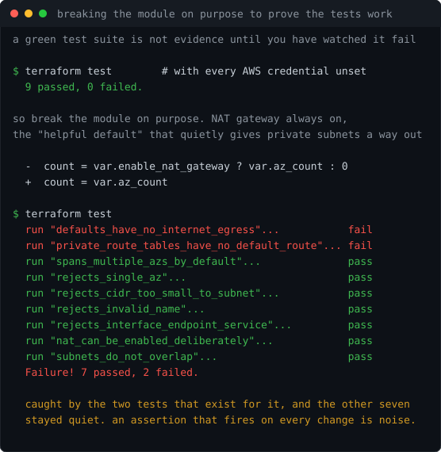

# Lab 14: Terraform AWS Secure VPC

<p align="center"></p>

[](https://github.com/ChromeData/terraform-aws-secure-vpc/actions/workflows/tests.yml)

**A reusable Terraform module where the secure network is what you get for writing nothing, and the insecure one costs you an argument. Tested without an AWS account, and the tests are proven by breaking the module on purpose.**

| | |
|---|---|
| **Domains** | Terraform module design, AWS networking, testing infrastructure code |
| **Built on** | Native `terraform test` with `mock_provider`. No Terratest, no Go, no cloud account |
| **Cost** | $0 to test, $0 to run at defaults. NAT is opt-in and it is the only thing that bills |
| **Status** | 9 tests passing with zero credentials, each one verified by a deliberate break (findings/) |

## Situation

Labs 12 and 13 both needed a VPC with public and private subnets across two availability zones. So both got one, written out by hand: 22 near-identical resources between them, differing mostly in name.

Two copies of a pattern is the standard signal to extract a module. Not because duplication is untidy, but because the copies had already started to drift. Lab 12 discovered its default security group was wide open and fixed it; lab 13 got the fix only because I remembered. A third lab would not have.

## Task

Extract the pattern into a module other people could actually depend on. That means a stable interface, defaults that are safe rather than convenient, and a test suite that runs without handing anyone an AWS account.

## Action

**The default is the security posture, so the defaults are the design.** Most public VPC modules ship `enable_nat_gateway = true`. This one ships `false`. A NAT gateway is roughly $32 a month per AZ, and more importantly it puts an outbound path into the tier that is supposed to have none. Most workloads that "need" one actually need a single gateway endpoint, which is free. Turning on egress should be a decision somebody made, not a default they inherited.

**Validation that rejects bad input at plan time.** `az_count` refuses 1, because one AZ is not highly available regardless of what else is configured. `cidr_block` refuses anything smaller than /20, because the subnet arithmetic cannot fit and the failure would otherwise surface as a confusing error deep inside `cidrsubnet`. `gateway_endpoints` refuses anything but S3 and DynamoDB, because everything else is an interface endpoint that bills hourly and a module should not hand somebody a surprise line on their invoice.

**One private route table per AZ, not one shared.** With NAT off this is cosmetic. The moment egress is added, a shared table routes every AZ through one gateway, which turns a cost optimisation into a single point of failure in the tier that existed to be redundant.

**A test suite that needs no AWS account.** Nine tests using native `terraform test` with `mock_provider`, covering both the assertions and the rejections. They deploy nothing and cost nothing.

**Then I broke the module on purpose to find out whether any of that was true.**

## Result

**Nine tests pass with every AWS credential unset. Three deliberate breaks, three catches, and the unaffected tests stayed quiet each time.**

The first version of the suite reported `Success! 9 passed` and could not run anywhere except my laptop. Without credentials the AWS provider fails at init, and the result was `0 passed, 1 failed, 8 skipped`. Eight skips read as "fine" in a CI summary while proving nothing. A module nobody can test without an AWS account is a module nobody tests.

So the number itself needed checking. I reverted the NAT gate so the gateway is always created, which is the exact shape of the mistake somebody makes trying to be helpful: two tests failed, seven stayed green. I collapsed the per-AZ route tables into one shared table, the change that looks like tidying up: caught. I dropped the offset from the subnet arithmetic so the ranges overlap: caught at plan time, rather than as an `InvalidSubnet.Conflict` from the API halfway through an apply.

**Lab 13 was then refactored onto the module, which is the part that actually tests an interface.** Its network file went from 130 lines to a module call. That refactor also surfaced the real hazard: moving resources into a module changes their address in state, so Terraform reads a cosmetic change as *destroy the entire network and rebuild it*. I measured it offline with the null provider rather than guessing or paying to find out: `3 to add, 0 to change, 3 to destroy` without `moved` blocks, `0 to add, 0 to change, 0 to destroy` with them.

<sub>What the tests still do not prove, stated plainly: mocked providers never call AWS, so these verify the module's logic and not that AWS accepts the resulting plan. And `enable_nat_gateway = true` has been planned but never applied, because it costs about $32 a month per AZ and this portfolio does not spend money. Both written up in [LAB-NOTES.md](./LAB-NOTES.md) and [findings/](./findings/).</sub>

## What I did not build

Terraform provides the module system, the test framework, and `mock_provider`. The interface design, the choice of which defaults are safe, the validation rules, the tests, and the deliberate breaks that verify them are mine.

This is deliberately not a competitor to `terraform-aws-modules/vpc`, which is far more capable. That module supports every topology anybody has ever asked for. This one holds an opinion and refuses input that contradicts it, which is the correct trade for a module with one owner and a known set of consumers, and the wrong trade for a public one.

## Use it

```hcl
module "vpc" {
  source = "git::https://github.com/ChromeData/terraform-aws-secure-vpc.git?ref=v0.1.0"

  name = "my-app"
}
```

That gets two AZs, public and private subnets, no internet path out of the private tier, a free S3 gateway endpoint, and the default security group stripped of every rule. Cost: nothing.

Full examples in [`examples/minimal`](./examples/minimal) ($0) and [`examples/complete`](./examples/complete) (NAT on across three AZs, roughly $96/month).

## Test it

```bash
terraform init && terraform test
```

No AWS account, no credentials, no cost. That is the point.

## Findings

- [`findings/test-positive-controls.txt`](./findings/test-positive-controls.txt) — the three deliberate breaks, the exact output, and what the suite still does not cover
- [`LAB-NOTES.md`](./LAB-NOTES.md) — the skipped-tests problem, and why the defaults are inverted from every other VPC module
